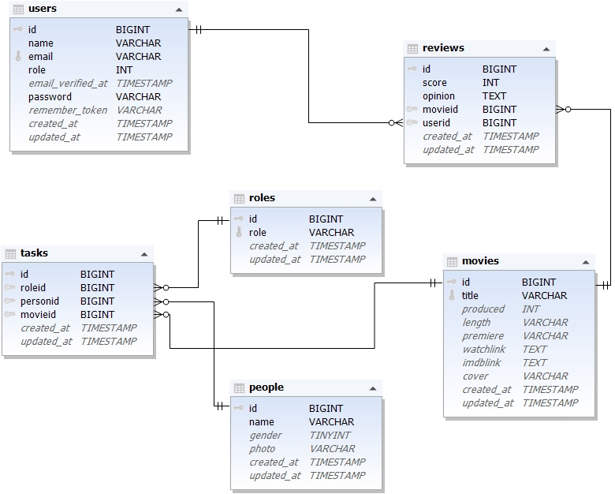

# Magyar filmek projekt
## A feladat rövid leírása, magyarázása

- Megkaptuk a két világháború között gyártott magyar filmek adatait egy-egy csv formátumú forrásként.
  
- Ezeket kiegészítve általunk keresett adatokkal célunk egy olyan weboldalt készíteni, melyet a felhasználók bátran használhatnak véleményírásra, információgyüjtésre avagy a film megtekintésére.
  
- Feladatunkat gyüjtőmunkával kezdtük, ahol a megadott forrásokat kiegészítettük, minden szemályről fotót kerestünk, és felvittük az adatbázisba.
  
- A létrehozott adatbázis lehetőséget biztosít arra, hogy az oldal látogatói böngészhessék a filmeket, míg a regisztrációval rendelkező felhasználók kedvenceiket egy külön felületen elmenthessék és értékelhessék.

- Az alkalmazás három különböző jogosultsági szinttel rendelkezik, amelyek meghatározzák a felhasználók hozzáférését az egyes funkciókhoz.
- Az adminisztrátor felel az adatbázis tartalmának feltöltéséért és folyamatos karbantartásáért.
A regisztrált felhasználók böngészhetnek és kereshetnek a filmek között, valamint kedvenceiket elmenthetik és értékelhetik.
A regisztrációval nem rendelkező látogatók kizárólag a tartalmak megtekintésére jogosultak.

- A feladat megvalósítása MySQL adatbázissal, Laravel alapú backenddel és Vue.js frontenddel történik, a csapatmunka Git és GitHub használatával, a megjelenés pedig saját CSS és Bootstrap segítségével készül.

# Adatbázis

## Diagram

## Users (felhasználók)
 - id
 - name (a felhasználó neve)
 - email (a felhasználó email-je)
 - role (a felhasználó szerepköre)
 - password (a felhasználó jelszava)

## Roles (szerepkörök)
 - id
 - role (szerepkör)

## Movies (filmek)
 - id
 - title (film cím)
 - produced (gyátási év)
 - length (film hossza percben)
 - premiere (bemutatás)
 - watchlink (egy link, ahol megtekinthető)
 - imdblink (imdb oldalra vezető link)

## Tasks (feladatok)
 - id
 - roleid (szerepkör id-je)
 - personid (az ember id-je)
 - movieid (film id-je)

## People (emberek)
 - id
 - name (az ember neve)
 - gender (az ember neme)
 - photo (egy kép az adott emberről)

## Reviews (vélemények)
 - id
 - score (elért eredmény)
 - opinion (írásos vélemény)
 - movieid (film id-je)
 - userid (user id-je)